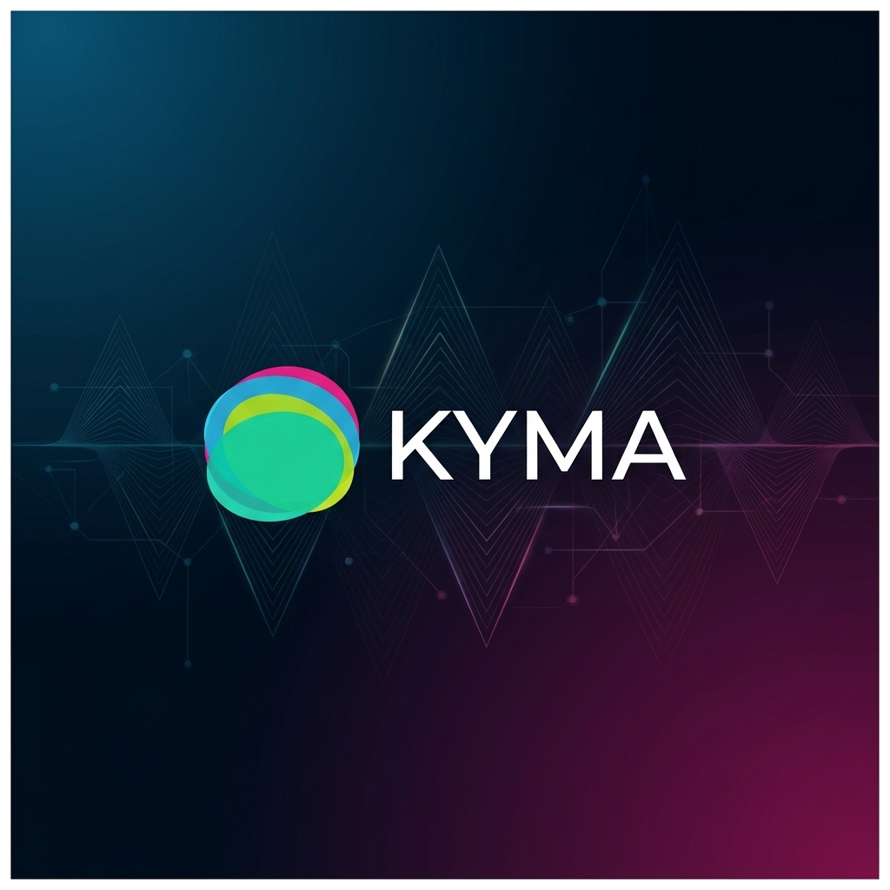

# KYMA
> **Real-time music recognition and live lyrics provider powered by Musixmatch**

**🏆 Submission for the Musixmatch Musicathon**

**Author:** Bo Lorenzo

---

## Demo Video
[Watch the demo on YouTube](https://youtu.be/QEGp2Ft0hhM)

---

## Project Description
**KYMA** is a web application designed to enrich the live music event experience by providing highly accurate real-time music recognition, immediate access to song lyrics, and deep metadata extraction for live performances.

By combining an audio-text hybrid recognition engine and deeply integrating with the **Musixmatch APIs**, KYMA "listens" to live performances (such as concerts or tribute bands), identifies the tracks in real-time, displays the full song lyrics on screen, and retrieves precise details about the composers of each specific track.

---

## How We Use Musixmatch (Core Feature)
Musixmatch is the core of our recognition and lyrics retrieval system:
* **`track.search`**: Used to download an artist's catalog (Tribute Band bias mode) to drastically improve recognition accuracy for specific live events.
* **`matcher.lyrics.get` / `track.lyrics.get`**: Used to fetch the official, high-quality plain-text lyrics for the recognized tracks.
* **`matcher.track.get`**: Crucial for retrieving the **official ISRC** of the recognized track, guaranteeing accuracy when identifying composers and publishers for royalty reporting purposes.

---

## Key Features

### Hybrid Recognition Engine
* **ACRCloud Integration:** Utilizes audio fingerprinting for high-precision music recognition.
* **ElevenLabs Scribe:** Leverages AI to transcribe live vocals in real-time, providing a secondary layer of validation for the audio fingerprint.
* **Smart Decision Logic:** By cross-referencing pure audio fingerprints and transcribed vocals against the Musixmatch database, the software guarantees correct matches even for live covers and custom arrangements.

### Context Awareness
* **Live Music & Tribute Bands:** By inputting the name of the performing tribute band or artist, KYMA optimizes its search algorithms, focusing specifically on that artist's catalog.
* **Metadata Aggregation:** The software performs deep searches to extract the correct and complete list of original composers and authors for every detected track.

### Live Session Management
* **Real-time Lyrics:** The interface displays detected songs in real-time, allowing users to instantly open and read the lyrics of the current track.
* **Manual Overrides:** Users can manually correct or annotate the recognition results during or after the live session.

---

## Technical Stack

### Backend
* **Language:** Python 3.x
* **Framework:** Flask
* **Audio Processing:** numpy, scipy, sounddevice
* **APIs:**
    * **Musixmatch API** (Lyrics, Search, ISRC)
    * ACRCloud (Audio Fingerprinting) 
    * ElevenLabs (Speech-to-Text)
    * Spotify Web API / MusicBrainz (Extra metadata)

### Frontend
* **Structure:** HTML5, CSS3
* **Logic:** Vanilla JavaScript (ES6+)
* **Architecture:** Real-time polling mechanism to update the live playlist and lyrics

---

## Installation & Setup

### Prerequisites
* Python 3.8+
* API keys for Musixmatch, ACRCloud, and ElevenLabs

### Steps

**1. Clone the repository**
```bash
git clone https://github.com/bostikbostik/KYMA.git
cd KYMA
```

**2. Install dependencies**
```bash
pip install -r requirements.txt
```

**3. Environment Setup**
Create a `.env` file in the root directory and add your API keys:
```env
MUSIXMATCH_API_KEY=your_musixmatch_key
ACR_HOST=Identify-EU-West-1.acrcloud.com
ACR_ACCESS_KEY=your_acr_key
ACR_ACCESS_SECRET=your_acr_secret
ELEVENLABS_API_KEY=your_elevenlabs_key
```

**4. Run the application**
```bash
python app.py
```
The application will start on the local server at: `http://localhost:5050`.